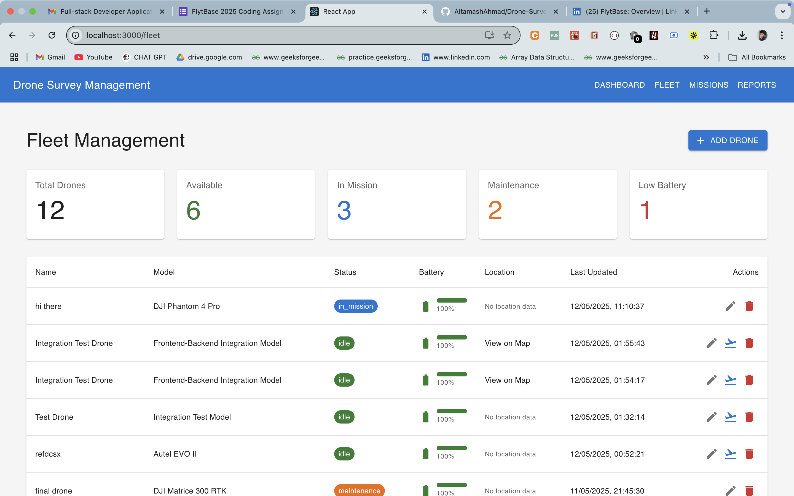

# Drone Survey Management System

A comprehensive platform for planning, managing, and monitoring autonomous drone surveys across multiple sites.

## System Overview

The Drone Survey Management System consists of four key functional components:

1. **Mission Planning and Configuration System**
   - Define survey areas and flight paths
   - Configure data collection parameters
   - Support for multiple survey patterns (grid, crosshatch, perimeter)

2. **Fleet Visualization and Management Dashboard**
   - Track and manage organization-wide drone fleet
   - Monitor drone status, battery levels, and locations
   - Add, update, and remove drones from the system

3. **Real-time Mission Monitoring Interface**
   - Track drone positions in real-time
   - View mission progress and telemetry data
   - Control missions (start, pause, resume, abort)

4. **Survey Reporting and Analytics Portal**
   - Generate comprehensive survey reports
   - Analyze mission data and results
   - Export reports in various formats

## Technology Stack

- **Frontend**: React.js with Material-UI
- **Backend**: Node.js/Express API
- **Database**: PostgreSQL
- **Real-time Communication**: Socket.io

## Screenshots

### Dashboard


### Fleet Management


### Missions


### Reports & Analytics


## Setup Instructions

### Prerequisites

- Node.js (v14+)
- npm (v6+)
- PostgreSQL (v12+)
- Git

### Step 1: Clone the Repository

```bash
git clone <repository-url>
cd drone-survey-system
```

### Step 2: Database Setup

1. Create a PostgreSQL database:
   ```sql
   CREATE DATABASE drone_survey_db;
   ```

2. Create a `.env` file in the backend directory:
   ```bash
   cd backend
   cp .env.example .env
   ```

3. Configure the database connection in `backend/.env`:
   ```
   # Database configuration
   DB_USER=postgres
   DB_PASSWORD=postgres
   DB_HOST=localhost
   DB_NAME=drone_survey_db
   DB_PORT=5432

   # Server configuration
   PORT=5001
   NODE_ENV=development

   # JWT configuration (for authentication)
   JWT_SECRET=your_jwt_secret_key_change_me_in_production

   # Drone simulation settings
   ENABLE_DRONE_SIMULATION=true
   SIMULATION_UPDATE_INTERVAL=5000
   ```

4. Initialize the database schema:
   ```bash
   cd backend
   npm install
   npm run setup-db
   ```

5. Add dummy data (optional but recommended for testing):
   ```bash
   npm run add-dummy-data
   ```

### Step 3: Backend Setup

1. Install backend dependencies:
   ```bash
   cd backend
   npm install
   ```

2. Start the backend server:
   ```bash
   npm start
   ```
   
   For development with auto-reload:
   ```bash
   npm run dev
   ```

   The backend server will run on http://localhost:5001

### Step 4: Frontend Setup

1. Create a `.env` file in the frontend directory:
   ```bash
   cd frontend
   cp .env.example .env
   ```

2. Configure the frontend environment in `frontend/.env`:
   ```
   # API configuration
   REACT_APP_API_URL=http://localhost:5001/api

   # Feature flags
   REACT_APP_ENABLE_REAL_TIME_UPDATES=true
   REACT_APP_ENABLE_FLIGHT_SIMULATION=true

   # UI Configuration
   REACT_APP_DEFAULT_THEME=light
   ```

3. Install frontend dependencies:
   ```bash
   cd frontend
   npm install
   ```

4. Start the frontend development server:
   ```bash
   npm start
   ```

   The frontend application will run on http://localhost:3000

### Step 5: Verify Installation

1. Open your browser and navigate to http://localhost:3000
2. You should see the Drone Survey Management System dashboard
3. If you added dummy data, you can log in with:
   - Username: admin
   - Password: password123

## Testing

### Adding Dummy Data

To populate the database with test data:

```bash
cd backend
npm run add-dummy-data
```

### Testing Backend API

To test all backend API endpoints:

```bash
cd backend
npm test
```

### Running All Tests

To run all tests in sequence:

```bash
./test-all.sh
```

## Documentation

Comprehensive documentation is available in the [docs](./docs) directory:

- [User Guide](./docs/USER_GUIDE.md) - Detailed instructions for using the system
- [Technical Documentation](./docs/TECHNICAL_DOCUMENTATION.md) - System architecture and implementation details
- [API Documentation](./docs/API_DOCUMENTATION.md) - Complete API reference

## Database Schema

The system uses the following main entities:

- **Users**: System users with different roles
- **Drones**: UAV devices used for surveys
- **Missions**: Planned and executed survey missions
- **Locations**: Survey sites and areas of interest
- **Waypoints**: Flight path points for missions
- **Mission Logs**: Events and status updates during missions
- **Survey Reports**: Results and analytics from completed missions
- **Collected Data**: Raw and processed data from surveys

## Troubleshooting

### Common Issues

1. **Database Connection Error**
   - Verify PostgreSQL is running
   - Check database credentials in `.env` file
   - Ensure the database exists

2. **Missing Tables**
   - Run `npm run setup-db` in the backend directory

3. **Frontend Can't Connect to Backend**
   - Verify the backend server is running
   - Check the `REACT_APP_API_URL` in frontend `.env` file
   - Ensure there are no CORS issues

4. **Socket.io Connection Issues**
   - Check that the `FRONTEND_URL` in backend `.env` matches your frontend URL
   - Verify that the Socket.io client version matches the server version 